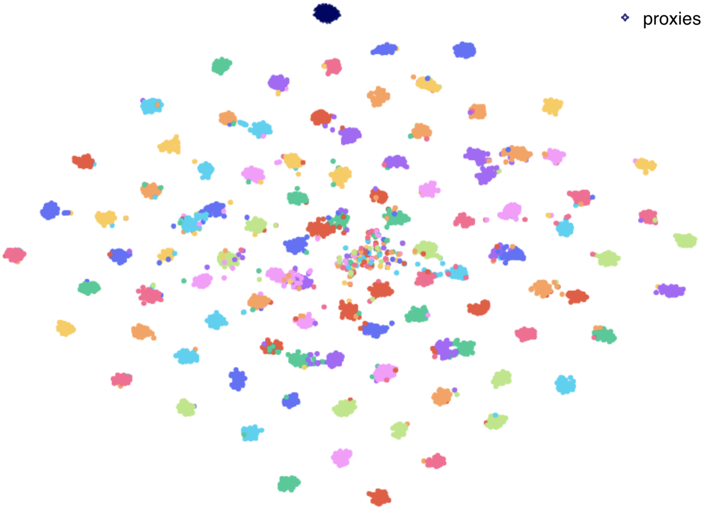
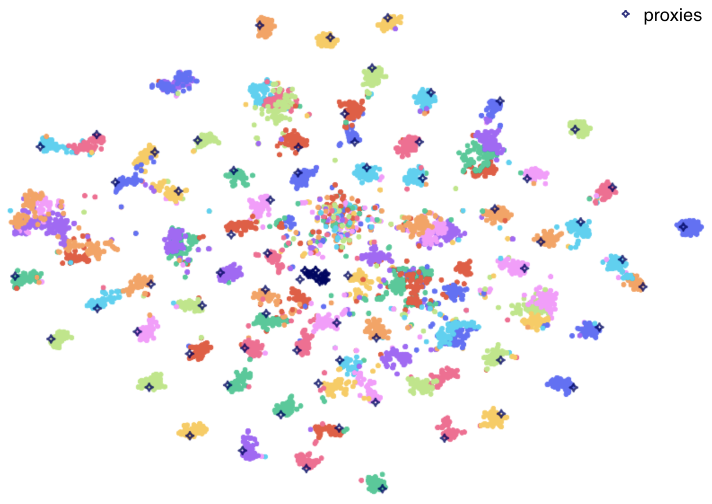

# Informative Sample-Aware Proxy for Deep Metric Learning

Official PyTorch implementation of ACM MM Asia 2022 paper [**Informative Sample-Aware Proxy for Deep Metric Learning**](https://arxiv.org/abs/2211.10382).

## Requirements

- Python3
- PyTorch (> 1.6)
- NumPy
- tqdm
- [wandb](https://wandb.ai/quickstart/pytorch)
- [plotly](https://plotly.com/python/getting-started/) (needed if you want to visualize with t-SNE)

## Datasets

1. Download four public benchmarks for deep metric learning
   - [CUB-200-2011](http://www.vision.caltech.edu/visipedia-data/CUB-200-2011/CUB_200_2011.tgz)
   - Cars-196 ([Img](http://imagenet.stanford.edu/internal/car196/car_ims.tgz), [Annotation](http://imagenet.stanford.edu/internal/car196/cars_annos.mat))
   - Stanford Online Products ([Link](https://cvgl.stanford.edu/projects/lifted_struct/))
   - In-shop Clothes Retrieval ([Link](http://mmlab.ie.cuhk.edu.hk/projects/DeepFashion.html))

2. Extract the tgz or zip file into `./data/` (Exceptionally, for Cars-196, put the files in `./data/cars196`)

## Training Embedding Network

<!-- You can download the trained model through the hyperlink in the table. -->

### CUB-200-2011

- Train a embedding network of Inception-BN using **Proxy-ISA**

```bash
python train.py --gpu_id 0 \
                --loss ProxyISA \
                --model bn_inception \
                --embedding_size 512 \
                --batch_size 128 \
                --lr 1e-4 \
                --dataset cub \
                --warm 0 \
                --lr_decay_step 10 \
                --enableMemory True
```

- Train a embedding network of ResNet-50 using **Proxy-ISA**

```bash
python train.py --gpu_id 0 \
                --loss ProxyISA \
                --model resnet50 \
                --embedding_size 512 \
                --batch_size 128 \
                --lr 1e-4 \
                --dataset cub \
                --warm 0 \
                --lr_decay_step 5 \
                --enableMemory True
```

<!-- | Method | Backbone | Recall@1 | MAP@R |
|:-:|:-:|:-:|:-:|:-:|:-:|
| Proxy-ISA | Inception-BN | 68.1 | 26.97 | -->

### Cars-196

- Train a embedding network of Inception-BN using **Proxy-ISA**

```bash
python train.py --gpu_id 0 \
                --loss ProxyISA \
                --model bn_inception \
                --embedding_size 512 \
                --batch_size 128 \
                --lr 1e-4 \
                --dataset cars \
                --warm 0 \
                --lr_decay_step 20 \
                --enableMemory True \
                --k 0.4
```

- Train a embedding network of ResNet-50 using **Proxy-ISA**

```bash
python train.py --gpu_id 0 \
                --loss ProxyISA \
                --model resnet50 \
                --embedding_size 512 \
                --batch_size 128 \
                --lr 1e-4 \
                --dataset cars \
                --warm 0 \
                --lr_decay_step 10 \
                --enableMemory True \
                --k 0.4
```

### Stanford Online Products

- Train a embedding network of Inception-BN using **Proxy-ISA**

```bash
python train.py --gpu_id 0 \
                --loss ProxyISA \
                --model bn_inception \
                --optimizer adamw \
                --embedding_size 512 \
                --batch_size 128 \
                --lr 6e-4 \
                --dataset SOP \
                --warm 1 \
                --bn_freeze False \
                --lr_decay_step 20 \
                --lr_decay_gamma 0.25 \
                --enableMemory True
```

### In-Shop Clothes Retrieval

- Train a embedding network of Inception-BN using **Proxy-ISA**

```bash
python train.py --gpu_id 0 \
                --loss ProxyISA \
                --model bn_inception \
                --optimizer adamw \
                --embedding_size 512 \
                --batch_size 128 \
                --lr 6e-4 \
                --dataset Inshop \
                --warm 1 \
                --bn_freeze False \
                --lr_decay_step 20 \
                --lr_decay_gamma 0.25 \
                --enableMemory True \
                --k 0.1
```

## Evaluating Image Retrieval

Follow the below steps to evaluate the trained model. 

Trained best model will be saved in `./logs/folder_name`.

```bash
# The parameters should be changed according to the model to be evaluated.
python evaluate.py --gpu_id 0 \
                   --batch_size 128 \
                   --model bn_inception \
                   --embedding_size 512 \
                   --dataset cub \
                   --resume /PATH/TO/YOUR/Model.pth
```

## Embedding Space Visualization

t-SNE visualization of 512-dimensional embedding space for the Cars-196 dataset (during training).

Left: Proxy-Anchor loss (Kim et al. CVPR 2020);
Right: Proxy-ISA (Ours)

<p align="left">&nbsp</p>

## Citation
    
    @InProceedings{Li_2022_MMAsia,
      title = {Informative Sample-Aware Proxy for Deep Metric Learning},
      author = {Li, Aoyu and Sato, Ikuro and Ishikawa, Kohta and Kawakami, Rei and Yokota, Rio},
      booktitle = {ACM Multimedia Asia (MMAsia '22)},
      year = {2022},
      doi = {10.1145/3551626.3564942}
    }